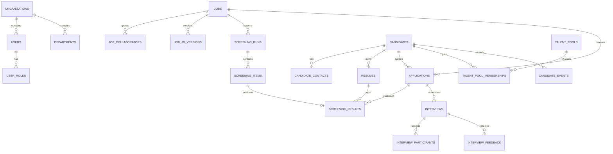

# UX-09B 数据模型与 REST API 契约

## 1. 契约原则

- API 前缀为 `/api/v1`，路径使用复数、小写、kebab-case 名词。
- JSON 字段使用 `snake_case`，时间为 UTC RFC 3339，ID 为 UUID。
- 集合统一返回 `{ "data": [], "meta": {} }`，单资源返回 `{ "data": {} }`。
- 大列表使用不透明游标；报表等需要页码的小结果集可使用 `page/per_page`。
- 写请求使用服务端权限、状态机和版本校验；客户端不得直接指定派生计数或审计字段。
- 错误使用 `application/problem+json`，不返回堆栈、SQL、对象键或 Provider 原始密钥。
- OpenAPI 文档由 FastAPI 模型生成，并作为前端类型生成和契约测试来源。

## 2. 逻辑数据模型



## 3. 表与约束

所有业务表包含 `id uuid`、`organization_id uuid`、`created_at`、`updated_at`；可编辑聚合包含 `version integer`。时间线和审计表只追加，不更新历史行。

### 3.1 身份与范围

| 表 | 关键字段 | 约束 |
| --- | --- | --- |
| `organizations` | `name`, `status`, `retention_policy_id` | MVP 部署只有一个有效组织 |
| `departments` | `name`, `parent_id` | 组织内名称与父级组合唯一 |
| `users` | `email`, `display_name`, `password_hash`, `status`, `department_id`, `authorization_version` | 组织内规范化邮箱唯一 |
| `user_roles` | `user_id`, `role` | `(user_id, role)` 唯一 |
| `user_sessions` | `user_id`, `token_hash`, `idle_expires_at`, `absolute_expires_at`, `revoked_at` | 只存令牌哈希 |
| `job_collaborators` | `job_id`, `user_id`, `access_role` | `(job_id, user_id, access_role)` 唯一 |
| `talent_pool_grants` | `pool_id`, `user_id`, `access_role` | 人才库权限不从职位权限隐式继承 |

角色枚举：`system_admin | recruiting_admin | recruiter | hiring_manager | interviewer`。

### 3.2 职位与版本

| 表 | 关键字段 | 约束 |
| --- | --- | --- |
| `jobs` | `title`, `department_id`, `owner_id`, `headcount`, `priority`, `status` | `headcount > 0` |
| `job_jd_versions` | `job_id`, `version_no`, `public_text`, `internal_criteria`, `created_by` | `(job_id, version_no)` 唯一；发布后不可修改 |
| `screening_rule_versions` | `job_id`, `version_no`, `required_criteria`, `bonus_criteria`, `weights`, `created_by` | `(job_id, version_no)` 唯一；生效版本不可修改 |
| `prompt_versions` | `name`, `version_no`, `template`, `response_schema`, `status` | `(name, version_no)` 唯一 |

职位状态：`draft | open | paused | closed | archived`。允许转换：

```text
draft -> open
open -> paused | closed
paused -> open | closed
closed -> archived
```

### 3.3 候选人、联系方式与简历

| 表 | 关键字段 | 约束 |
| --- | --- | --- |
| `candidates` | `display_name`, `city`, `summary`, `owner_id`, `retention_due_at`, `deleted_at` | 候选人不保存职位阶段 |
| `candidate_contacts` | `candidate_id`, `type`, `normalized_value`, `display_value`, `is_primary` | 联系方式加密保存；规范化哈希用于重复提示 |
| `resumes` | `candidate_id`, `version_no`, `object_id`, `parse_status`, `parsed_text`, `structured_data`, `quality`, `parser_version` | `(candidate_id, version_no)` 唯一 |
| `file_objects` | `storage_key`, `original_name`, `sha256`, `mime_type`, `size_bytes`, `scan_status` | `storage_key` 唯一；对象私有 |
| `candidate_duplicate_hints` | `left_candidate_id`, `right_candidate_id`, `signals`, `status` | 只提示，不自动合并 |
| `candidate_merge_records` | `survivor_id`, `merged_id`, `mapping`, `created_by` | 合并可追溯 |

`parse_status`：`pending | scanning | parsing | parsed | partial | failed | quarantined`。

### 3.4 职位申请与时间线

| 表 | 关键字段 | 约束 |
| --- | --- | --- |
| `applications` | `candidate_id`, `job_id`, `resume_id`, `stage`, `source`, `source_application_id`, `owner_id`, `human_conclusion` | 同候选人/职位最多一条活跃申请 |
| `application_stage_events` | `application_id`, `from_stage`, `to_stage`, `reason_code`, `reason_text`, `actor_id` | 追加式；与流转同事务 |
| `candidate_notes` | `candidate_id`, `application_id`, `author_id`, `body`, `visibility` | 软删除也保留审计引用 |
| `candidate_tags` | `candidate_id`, `tag_id` | `(candidate_id, tag_id)` 唯一 |
| `candidate_events` | `candidate_id`, `application_id`, `event_type`, `summary`, `actor_id`, `metadata` | 用户时间线，不保存敏感全文 |

申请阶段：

```text
new -> review -> contact -> interview_pending -> interviewing -> decision -> passed -> hired
任一非终态 -> rejected | withdrawn
```

终态为 `hired | rejected | withdrawn`。重新参与时创建新申请，不重开终态行。数据库使用部分唯一索引：

```sql
CREATE UNIQUE INDEX uq_active_application_per_candidate_job
ON applications (organization_id, candidate_id, job_id)
WHERE stage NOT IN ('hired', 'rejected', 'withdrawn');
```

### 3.5 筛选

| 表 | 关键字段 | 约束 |
| --- | --- | --- |
| `screening_runs` | `job_id`, `jd_version_id`, `rule_version_id`, `prompt_version_id`, `source`, `status`, `total_count` | 创建后锁定版本引用 |
| `screening_items` | `run_id`, `file_object_id`, `candidate_id`, `resume_id`, `application_id`, `status`, `error_code` | `(run_id, file_object_id)` 唯一 |
| `screening_results` | `item_id`, `application_id`, `resume_id`, `rule_score`, `llm_score`, `recommendation`, `required_hits`, `required_missing`, `bonus_hits`, `risks`, `questions`, `human_override` | 一次执行产生一版不可变结果 |
| `llm_invocations` | `result_id`, `provider`, `model`, `prompt_version_id`, `request_field_manifest`, `status`, `latency_ms`, `usage`, `error_code` | 不保存密钥和完整敏感 Prompt |

筛选批次状态：`queued | parsing | rule_scoring | llm_scoring | completed | partial | failed | cancelled`。文件项状态独立保存，批次状态和进度从文件项聚合。

### 3.6 面试与反馈

| 表 | 关键字段 | 约束 |
| --- | --- | --- |
| `interviews` | `application_id`, `round_name`, `method`, `starts_at`, `ends_at`, `timezone`, `location`, `meeting_url`, `status`, `notification_status` | `ends_at > starts_at` |
| `interview_participants` | `interview_id`, `user_id`, `role`, `required_feedback` | `(interview_id, user_id)` 唯一 |
| `interview_feedback` | `interview_id`, `author_id`, `status`, `ratings`, `strengths`, `risks`, `conclusion`, `notes`, `submitted_at` | `(interview_id, author_id)` 唯一 |
| `feedback_revisions` | `feedback_id`, `previous_payload`, `new_payload`, `reason`, `actor_id` | 修改已提交反馈时必写 |

面试状态：`draft | scheduled | confirmed | completed | pending_feedback | feedback_completed | rescheduled | cancelled | no_show`。反馈状态：`draft | submitted | amended`。

### 3.7 人才库、治理与后台任务

| 表 | 关键字段 | 约束 |
| --- | --- | --- |
| `talent_pools` | `name`, `visibility`, `owner_id` | 组织内有效名称唯一 |
| `talent_pool_memberships` | `pool_id`, `candidate_id`, `owner_id`, `suitable_roles`, `reason`, `next_contact_at`, `retention_until`, `status` | `(pool_id, candidate_id)` 唯一 |
| `llm_provider_configs` | `provider`, `base_url`, `model`, `encrypted_api_key`, `enabled`, `allowed_job_ids` | API 从不返回密钥 |
| `retention_policies` | `terminal_days`, `talent_pool_days`, `backup_window_days` | 30 至 3650 天校验 |
| `deletion_requests` | `candidate_id`, `status`, `impact_manifest`, `requested_by`, `approved_by` | 删除状态机 |
| `legal_holds` | `candidate_id`, `reason`, `placed_by`, `released_by`, `released_at` | 有效法律保留覆盖普通到期删除 |
| `audit_logs` | `actor_id`, `action`, `resource_type`, `resource_id`, `result`, `ip_hash`, `trace_id`, `metadata` | 追加式、按月分区 |
| `background_jobs` | `type`, `payload`, `status`, `priority`, `attempts`, `run_after`, `lease_owner`, `lease_expires_at`, `dedupe_key`, `last_error_code` | 活跃 `dedupe_key` 唯一 |
| `job_attempts` | `job_id`, `attempt_no`, `started_at`, `finished_at`, `result`, `error_code` | 重试不覆盖历史证据 |
| `outbox_events` | `topic`, `aggregate_type`, `aggregate_id`, `payload`, `published_at`, `attempts` | 与业务变更同事务写入 |
| `idempotency_records` | `user_id`, `key`, `request_hash`, `status_code`, `response_body`, `expires_at` | `(user_id, key)` 唯一 |

## 4. 索引与查询策略

- `applications(job_id, stage, updated_at desc)` 支持职位漏斗。
- `candidates(owner_id, updated_at desc)` 和 `candidate_contacts(normalized_hash)` 支持列表与重复提示。
- PostgreSQL `tsvector` 索引覆盖候选人姓名、技能、经历摘要和解析文本；联系方式使用精确哈希检索。
- `interviews(starts_at, status)`、`interview_participants(user_id, interview_id)` 支持日历和待办。
- `screening_items(run_id, status)` 支持进度和失败过滤。
- `background_jobs(status, run_after, priority)` 对可领取任务建立部分索引。
- `audit_logs(organization_id, created_at desc)` 按月分区并单独设置保留策略。

## 5. API 资源目录

### 5.1 认证与当前用户

| 方法 | 路径 | 说明 |
| --- | --- | --- |
| `POST` | `/api/v1/auth/login` | 建立服务端会话 |
| `POST` | `/api/v1/auth/logout` | 撤销当前会话 |
| `GET` | `/api/v1/me` | 当前用户、角色、权限摘要 |
| `GET` | `/api/v1/me/tasks` | 本人招聘和面试待办 |

### 5.2 职位

| 方法 | 路径 | 说明 |
| --- | --- | --- |
| `GET/POST` | `/api/v1/jobs` | 列表、新建 |
| `GET/PATCH` | `/api/v1/jobs/{job_id}` | 详情、编辑；PATCH 要求 `If-Match` |
| `POST` | `/api/v1/jobs/{job_id}/transitions` | 发布、暂停、恢复、关闭、归档 |
| `GET/POST` | `/api/v1/jobs/{job_id}/jd-versions` | 读取或创建 JD 版本 |
| `GET` | `/api/v1/jobs/{job_id}/funnel` | 从申请事实聚合漏斗 |
| `GET/POST/DELETE` | `/api/v1/jobs/{job_id}/collaborators` | 管理职位范围 |

### 5.3 导入和筛选

前端将一次导入编排为“创建批次 -> 逐文件上传 -> 启动批次”，从而支持单文件错误和断点恢复。

| 方法 | 路径 | 说明 |
| --- | --- | --- |
| `POST` | `/api/v1/jobs/{job_id}/screening-runs` | 创建空批次并锁定版本 |
| `POST` | `/api/v1/screening-runs/{run_id}/items` | 流式上传单文件；要求幂等键 |
| `POST` | `/api/v1/screening-runs/{run_id}/start` | 校验并入队 |
| `GET` | `/api/v1/screening-runs/{run_id}` | 状态、总数、已处理数和错误摘要 |
| `GET` | `/api/v1/screening-runs/{run_id}/items` | 文件级结果、游标分页和过滤 |
| `POST` | `/api/v1/screening-items/{item_id}/retry` | 重试允许恢复的失败阶段 |
| `POST` | `/api/v1/screening-runs/{run_id}/bulk-actions` | 推进、淘汰或入库；人工动作 |

进度使用 2 秒轮询作为 MVP 基线；API 同时保留 `updated_at` 和 ETag，后续可无破坏升级到 SSE。

### 5.4 候选人和申请

| 方法 | 路径 | 说明 |
| --- | --- | --- |
| `GET/POST` | `/api/v1/candidates` | 授权范围列表、人工新建 |
| `GET/PATCH` | `/api/v1/candidates/{candidate_id}` | 详情和主档修正 |
| `GET` | `/api/v1/candidates/{candidate_id}/timeline` | 游标分页时间线 |
| `GET/POST` | `/api/v1/candidates/{candidate_id}/notes` | 备注 |
| `GET` | `/api/v1/candidates/{candidate_id}/resumes` | 简历版本列表 |
| `GET` | `/api/v1/resumes/{resume_id}/preview` | 授权预览；记录审计 |
| `POST` | `/api/v1/resumes/{resume_id}/download-tickets` | 生成短期一次性下载票据 |
| `POST` | `/api/v1/download-tickets/consume` | 在 JSON 请求体中消费票据并流式返回附件，票据不得进入 URL 或日志 |
| `GET` | `/api/v1/candidates/{candidate_id}/applications` | 历史申请 |
| `POST` | `/api/v1/jobs/{job_id}/applications` | 为已有候选人创建申请 |
| `POST` | `/api/v1/applications/{application_id}/transitions` | 阶段流转和原因 |
| `PATCH` | `/api/v1/applications/{application_id}` | 负责人、人工结论等非状态字段 |

候选人列表默认不返回完整联系方式、解析文本和反馈；详情字段根据权限裁剪，而不是仅在前端脱敏。PII 响应统一返回 `Cache-Control: no-store`。被授权职位的用人经理可查看有大小限制的解析文本预览，但联系方式保持脱敏，且无权创建或消费原始简历下载票据。

### 5.5 面试和反馈

| 方法 | 路径 | 说明 |
| --- | --- | --- |
| `GET/POST` | `/api/v1/interviews` | 授权范围列表、创建面试 |
| `GET/PATCH` | `/api/v1/interviews/{interview_id}` | 详情、改期和参与人调整 |
| `POST` | `/api/v1/interviews/{interview_id}/transitions` | 确认、完成、取消、未到场 |
| `GET` | `/api/v1/interviews/{interview_id}/calendar-file` | 下载 ICS |
| `GET/PUT` | `/api/v1/interviews/{interview_id}/my-feedback` | 本人反馈草稿 |
| `POST` | `/api/v1/interviews/{interview_id}/my-feedback/submit` | 提交反馈，要求幂等键 |
| `POST` | `/api/v1/interview-feedback/{feedback_id}/amendments` | 有权限修改并记录理由 |

### 5.6 人才库、报表和设置

| 方法 | 路径 | 说明 |
| --- | --- | --- |
| `GET/POST` | `/api/v1/talent-pools` | 列表、新建 |
| `GET/PATCH` | `/api/v1/talent-pools/{pool_id}` | 详情、设置 |
| `GET/POST` | `/api/v1/talent-pools/{pool_id}/memberships` | 成员列表、加入 |
| `DELETE` | `/api/v1/talent-pool-memberships/{membership_id}` | 移出人才库 |
| `POST` | `/api/v1/talent-pool-memberships/{membership_id}/reactivations` | 创建新申请，保留来源申请 |
| `GET` | `/api/v1/reports/recruiting-funnel` | 授权范围漏斗 |
| `GET` | `/api/v1/reports/screening-quality` | 解析和评分成功率 |
| `POST` | `/api/v1/exports` | 创建受控后台导出 |
| `GET/PATCH` | `/api/v1/settings/llm-provider` | 读取脱敏配置、从部署白名单更新配置；密钥只写不读 |
| `POST` | `/api/v1/settings/llm-provider/test` | 固定内容连接测试 |
| `GET/PATCH` | `/api/v1/settings/retention-policy` | 保留策略 |
| `GET` | `/api/v1/audit-logs` | 授权审计查询 |

## 6. 关键请求与响应

### 6.1 申请流转

```http
POST /api/v1/applications/4c6.../transitions
If-Match: "7"
Idempotency-Key: 6b4f...
Content-Type: application/json

{
  "target_stage": "rejected",
  "reason_code": "missing_required_skill",
  "reason_text": "缺少岗位必须的生产部署经验"
}
```

```json
{
  "data": {
    "id": "4c6...",
    "stage": "rejected",
    "version": 8,
    "updated_at": "2026-07-12T08:30:00Z"
  }
}
```

### 6.2 筛选进度

```json
{
  "data": {
    "id": "90a...",
    "status": "llm_scoring",
    "total_count": 18,
    "processed_count": 11,
    "success_count": 9,
    "partial_count": 1,
    "failed_count": 1,
    "current_stage": "LLM 评分",
    "updated_at": "2026-07-12T08:31:02Z"
  }
}
```

### 6.3 错误

```http
HTTP/1.1 409 Conflict
Content-Type: application/problem+json
```

```json
{
  "type": "https://hr.example.com/problems/resource-version-conflict",
  "title": "资源已被其他人修改",
  "status": 409,
  "detail": "请刷新后确认最新状态，再重新提交。",
  "code": "resource_version_conflict",
  "trace_id": "01J...",
  "errors": []
}
```

稳定错误码至少包括：`authentication_required`、`permission_denied`、`resource_not_found`、`validation_failed`、`invalid_state_transition`、`resource_version_conflict`、`active_application_exists`、`file_type_not_allowed`、`file_too_large`、`file_quarantined`、`llm_temporarily_unavailable`、`rate_limit_exceeded`。

## 7. 分页、过滤与排序

- 候选人：`?job_id=&stage=&owner_id=&source=&score_gte=&q=&cursor=&limit=50&sort=-updated_at`。
- 筛选项：`?status=&recommendation=&rule_score_gte=&llm_score_gte=&q=&cursor=`。
- 面试：`?from=&to=&interviewer_id=&status=&cursor=`。
- 人才库：`?pool_id=&skills=&city=&next_contact_before=&q=&cursor=`。
- `limit` 默认 50，最大 100；游标绑定排序字段和组织范围，客户端不得解析。
- 所有筛选先应用授权范围，再计算总数、聚合和导出。

## 8. 状态命令规则

- 每个 transition endpoint 接收目标状态和原因，不接收任意 `from_state`。
- 服务端读取当前状态、锁定聚合、校验允许边、权限和必要字段，再原子提交。
- 终态申请不能重开；使用 reactivation 创建新申请。
- 淘汰必须有原因；撤回和淘汰使用不同命令语义和报表口径。
- 面试只有被安排参与人可提交本人反馈；普通面试官不能读取或修改他人草稿。
- AI、规则引擎和后台任务不能调用申请通过或淘汰命令。

## 9. 限流和上传限制

- 登录：每 IP 和账号 5 次/5 分钟，超限返回 429。
- 普通 API：每用户 300 次/分钟；下载和导出采用更低独立配额。
- 单文件最大 10MB，单批最多 100 份、500MB；逐文件流式写入隔离区，允许 `.pdf`、`.docx`、`.txt`，并校验 MIME 与 magic。500MB 上限必须经过并发上传和磁盘配额负载测试，未通过前生产默认 100MB。
- 文件名只作显示元数据，服务端不直接拼接路径。
- 解压缩大小、PDF 页数、解析时间和内存均有上限。

## 10. 契约测试门槛

1. OpenAPI Schema 在 CI 中生成并检查无意破坏性变更。
2. 每个角色至少覆盖一次允许访问和一次越权拒绝。
3. 每个状态机覆盖合法边、非法边、终态和并发冲突。
4. 上传覆盖伪装 MIME、损坏文件、超限、重复和部分成功。
5. 幂等操作覆盖相同键同请求、相同键不同请求和处理中重试。
6. 筛选进度、职位漏斗和报表与底层事实一致。
7. API 响应和日志扫描证明不包含 API Key、Cookie、完整联系方式或简历正文。
8. 权限测试覆盖列表、计数、搜索、直接 ID、预览、下载、导出和后台任务，拒绝时不泄露资源是否存在。
9. LLM Provider 测试覆盖 loopback、私网、云元数据、IPv6 本地地址、重定向、DNS 重绑定和未允许端口。
10. 审计数据库角色只能插入，不能更新或删除；成功、拒绝和失败操作都产生安全事件。
