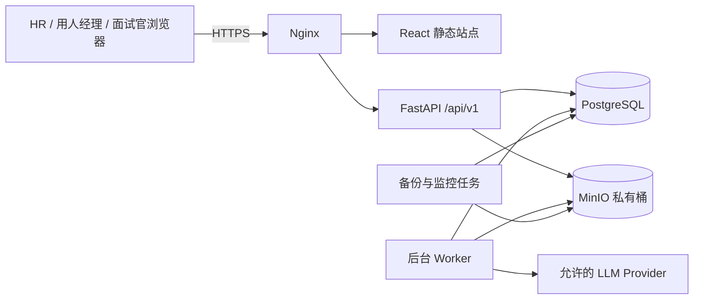

# UX-09A 服务端 MVP 技术架构

## 1. 能力声明

本阶段把已经通过 UX-08 验收的招聘原型升级为可部署、可恢复、可审计的内部招聘系统。HR、用人经理和面试官通过浏览器完成职位、简历筛选、候选人推进、面试、反馈和人才库闭环；所有业务事实由服务端持久化并按权限返回。

## 2. 决策状态

| 决策 | 结论 | 状态 |
| --- | --- | --- |
| 应用形态 | 单租户模块化单体 | 已确定 |
| 后端 | Python 3.12、FastAPI、SQLAlchemy 2、Alembic、Pydantic 2 | 已确定 |
| 数据库 | PostgreSQL 16 | 已确定 |
| 附件 | S3 兼容私有对象存储，首期使用 MinIO | 已确定 |
| 后台任务 | PostgreSQL 持久任务表与独立 Worker | 已确定 |
| 浏览器认证 | PostgreSQL 中的不可预测会话，HttpOnly Cookie | 已确定 |
| 部署 | 单服务器 Docker Compose，Nginx 统一入口 | 已确定 |
| 前端 | 保留 React/Vite，逐模块替换原型内存数据 | 已确定 |
| OCR | P1，不阻塞文本型 PDF、DOCX、TXT 的 MVP | 已确定 |
| 邮件/日历自动集成 | P1；MVP 生成邀请文本和 ICS | 已确定 |
| 多租户 SaaS | 非目标 | 已确定 |

不采用微服务、Redis、Kubernetes或事件总线。当前目标容量为 50 名内部用户、10,000 名候选人，这些组件会增加运维面而没有形成必要收益。

现有 `app/web_app.py` 只保留为本地简历筛选工具和迁移参考。它没有新 ATS 所需的用户认证、资源授权和生产文件隔离，禁止直接暴露公网或作为 UX-09 后端部署。

## 3. 系统上下文



浏览器只访问 Nginx。PostgreSQL、MinIO、API 内部端口和 Worker 不暴露公网。LLM 是可选外部依赖，失败不能阻断规则筛选和人工招聘流程。

## 4. 模块边界

后端保持一个代码库和一个数据库，但按业务模块隔离路由、服务、模型和权限策略。

| 模块 | 责任 | 不拥有 |
| --- | --- | --- |
| Identity | 本地账号、会话、角色、部门、职位授权 | 招聘业务数据 |
| Jobs | 职位、JD 版本、规则版本、协作者 | 候选人主档 |
| Candidates | 候选人、联系方式、简历版本、标签、备注、时间线 | 某职位流程状态 |
| Applications | 职位申请、阶段流转、人工结论、来源申请 | 简历文件解析 |
| Screening | 导入批次、文件处理、规则结果、LLM 结果、重试 | 自动改变申请阶段 |
| Interviews | 面试安排、参与人、冲突检查、ICS、通知状态 | 用户账号管理 |
| Feedback | 反馈草稿、提交、修改理由、完成度 | 最终招聘决策 |
| Talent | 人才库、成员关系、保留期、重新激活 | 覆盖历史申请 |
| Reports | 基于业务事实的查询模型与导出 | 独立写入业务事实 |
| Settings | LLM、保留策略、评价模板、状态原因 | 明文密钥返回 |
| Audit | 追加式业务审计与安全审计 | 可编辑操作历史 |
| Tasks | 持久任务租约、重试、进度、失败恢复 | 业务规则本身 |

模块间调用通过应用服务完成，不允许路由直接跨模块修改数据库模型。

## 5. 核心不变量

1. `candidate` 表示自然人，职位阶段只存在于 `application`。
2. 同一候选人和职位最多存在一条非终态申请；再次参与必须创建新申请并引用 `source_application_id`。
3. 简历、JD、规则和 Prompt 都是版本化事实；历史筛选结果不能随配置修改而变化。
4. 规则结果与 LLM 结果分别保存。LLM 失败保留规则结果，AI 不能自动通过、淘汰或通知候选人。
5. 人才库成员关系独立于申请，入库和重新激活不能覆盖历史申请。
6. 面试反馈按“面试 + 面试官”归属，草稿仅作者可见；所有必需反馈提交后申请才可进入待决策。
7. 状态流转、简历查看/下载、导出、权限配置、LLM 调用和删除均写审计。
8. 派生计数不作为独立业务真相；职位漏斗和报表从申请、面试和任务事实查询或可重建投影生成。
9. 所有写操作在服务端做权限和版本校验，前端隐藏按钮不构成安全控制。

## 6. 认证与授权

### 6.1 会话

- 本地账号密码使用 Argon2id 哈希。
- 登录成功生成 256 位随机会话令牌；数据库只保存令牌哈希。
- Cookie 使用 `__Host-` 前缀、`HttpOnly`、`Secure`、`SameSite=Lax` 和 `Path=/`，不设置 Domain。
- 30 分钟无操作超时，最长会话 12 小时；退出、禁用账号和重置密码立即撤销会话。
- 登录、权限变化和敏感操作重新认证后轮换会话；用户保存 `authorization_version`，角色或范围变化会撤销旧版本会话。
- 所有变更请求校验 CSRF Token 和同源 `Origin`。
- 登录、失败、退出、撤销和权限拒绝记录安全事件，但不记录密码或会话原文。
- OIDC 作为兼容接口保留到 P1，不影响本地账号 MVP。

### 6.2 权限求值

权限按以下顺序求交集：

```text
有效用户
AND 角色权限
AND 招聘数据权限
AND 资源范围（部门 / 职位 / 被分配面试）
AND 字段权限（联系方式 / 简历 / 反馈 / 导出）
```

角色包括：系统管理员、招聘管理员、HR、用人经理、面试官。系统管理员默认只管理系统配置，不自动获得招聘数据读取权。职位授权通过 `job_collaborators` 显式记录；人才库权限独立授权；面试官只在被分配面试范围内读取最小候选人快照。简历、反馈、导出和后台任务通过父资源逐级求值，不接受仅凭直接 ID 的访问。

## 7. 数据与文件边界

- PostgreSQL 保存结构化业务事实和解析文本；MinIO 保存原始简历、ICS 和受控导出文件。
- 对象键使用服务器生成的 UUID，不使用候选人姓名或原文件名。
- 桶保持私有。预览和下载由 API 授权后生成最多 60 秒的签名地址，或由 API 受控流式返回。
- PII 响应使用 `Cache-Control: no-store`；原件以附件方式返回并设置 `X-Content-Type-Options: nosniff`，浏览器 Service Worker 不缓存简历和反馈。
- 文件保存 SHA-256、MIME、magic、大小、原始文件名和上传人；相同哈希只提示重复，不自动合并候选人。
- 上传先进入隔离前缀，完成格式、大小和恶意文件扫描后才进入可解析状态。
- PDF/DOCX 解析在无网络、非特权、只读根文件系统的独立 Worker 容器中执行，设置 CPU、内存、临时空间、文件数、ZIP 条目/解压比、页数和执行超时。
- Web、解析、删除和备份使用不同服务身份及最小对象存储权限。
- 日志、Tracing 和错误响应禁止包含简历正文、完整联系方式、API Key、Cookie 或签名 URL。
- 生产环境要求数据库和对象存储磁盘加密、服务间私网、HTTPS 和定期密钥轮换。

## 8. 筛选流水线与持久任务

### 8.1 流水线

```text
上传校验 -> 恶意文件扫描 -> 文本解析 -> 结构化提取
         -> 候选人重复提示 -> 规则评分 -> 可选 LLM 评分 -> 完成
```

每份文件独立执行，单文件失败不会回滚同批其他文件。批次进度由文件处理记录聚合，始终可得到 `已处理数/总数`。

### 8.2 PostgreSQL 任务队列

- API 在业务事务中写入 `background_jobs`，Worker 使用 `FOR UPDATE SKIP LOCKED` 领取任务。
- 业务变化与需要异步投递的事件在同一事务中写入 `outbox_events`，避免数据库已提交但通知、投影或审计转发丢失。
- 任务包含类型、业务引用、状态、优先级、尝试次数、下次执行时间、租约到期时间和去重键。
- Worker 定期续租；进程崩溃后，租约到期的任务可重新领取。
- 只对超时、429 和临时网络故障指数退避重试；格式错误和策略拒绝进入不可重试失败。
- 每个处理器必须幂等。外部副作用写入稳定幂等键，数据库变更使用唯一约束保护。
- 失败任务保留用户可读原因、内部错误码和追踪 ID，不把堆栈返回浏览器。

这避免首期引入 Redis，同时满足页面刷新、浏览器关闭和短暂重启后的任务恢复要求。

## 9. 一致性与并发

- 创建申请、阶段流转、安排面试、提交反馈、人才库激活均在单个数据库事务内完成。
- 可编辑聚合带整数 `version`；客户端写入时提交 `If-Match`，版本冲突返回 `409 resource_version_conflict`。
- 上传、批量动作、反馈提交和重新激活支持 `Idempotency-Key`，24 小时内重复请求返回首次结果。
- 状态变化同时写 `application_stage_events` 和 `audit_logs`。
- 外部 LLM、扫描器和通知调用不持有数据库长事务；先持久化意图，再由 Worker 执行并回写结果。

## 10. LLM Gateway

- 默认禁用，仅系统管理员从部署级 Provider 白名单中选择 Provider、Base URL 和模型；招聘管理员只看启用状态。普通请求不能提交任意 Base URL。
- API Key 使用部署密钥加密后存储，主加密密钥只来自环境或服务器密钥文件。
- Provider 强制 HTTPS、证书校验、允许主机/端口和出口策略；拒绝 loopback、link-local、RFC1918、云元数据地址、未批准重定向和 DNS 重绑定结果。内部 HTTP Provider 只能由部署配置显式例外开启。
- 测试连接只发送固定探测内容，不发送简历或 JD。
- 正式调用按岗位策略去除姓名、手机号、邮箱、证件和地址，再发送最少必要字段。
- 每次调用记录 Provider、模型、Prompt 版本、输入字段清单、耗时、Token 统计、结果状态和审计引用，不记录密钥。
- Provider 返回 429、超时、不可达或结构错误时，结果标为部分失败并允许重试。

## 11. 部署拓扑

单服务器 Compose 包含：

| 容器 | 说明 |
| --- | --- |
| `proxy` | TLS、静态资源、API 反向代理、上传限制、安全响应头 |
| `api` | FastAPI，多进程数量按服务器资源配置 |
| `worker` | 解析、筛选、LLM、导出、删除等后台任务 |
| `postgres` | 业务库、会话、任务和审计 |
| `minio` | 私有简历和导出对象 |
| `backup` | 定时数据库和对象存储备份、保留与校验 |

生产配置不把数据库、MinIO 控制台和 API 内部端口绑定到公网。开发环境可使用相同 Compose 拓扑，但允许本机端口和合成数据。

## 12. 可观测性与恢复

- 每个请求生成 `trace_id`，后台任务继承关联 ID。
- 指标至少覆盖请求延迟/错误率、登录失败、任务积压/租约超时、解析失败率、LLM 429/超时、对象存储容量、备份结果。
- 健康检查分为存活 `/health/live` 和就绪 `/health/ready`；就绪检查数据库和对象存储，不依赖外部 LLM。
- PostgreSQL 每日全量备份并保留恢复校验；对象存储启用版本或同步备份。
- 上线前完成一次候选人、申请、简历、反馈和附件的恢复演练，证明 RPO 24 小时、RTO 4 小时目标。
- 发布采用镜像版本和只向前 Alembic 迁移；回滚应用前先确认数据库兼容，不执行自动破坏性降级。

## 13. 保留与删除

- 每名候选人计算 `retention_due_at`，来源包括活跃申请、人才库成员关系、企业策略和合法保留标记。
- 删除任务先生成影响清单，再删除对象文件、解析文本、搜索投影和临时导出，最后匿名化不可删除的审计引用。
- 删除任务具有 `requested -> approved -> executing -> completed/failed` 状态和操作者记录。
- 备份中的删除遵循可控备份窗口，不承诺对不可变备份即时物理擦除；恢复后必须重新执行删除清单。

## 14. 非目标

- 不直接抓取 BOSS 直聘等平台，也不规避平台访问控制。
- 不实现 Offer、审批、背调、入职、候选人门户和多租户计费。
- 不在 MVP 自动发送邮件、短信或即时消息。
- 不把 AI 结论作为自动招聘决定。
- 不在本阶段替换已验证的 UI 结构或重新做视觉设计。

## 15. 完成门槛

1. 一条 E2E 流程可在重启后继续：创建职位、导入、筛选、复核、面试、反馈、决策、入库、重新激活。
2. 角色矩阵同时通过 API 和页面自动测试，越权访问不返回摘要。
3. 100 份简历任务允许部分失败、逐份重试和进度恢复。
4. LLM 关闭或故障时规则筛选与人工流程完整可用。
5. 备份恢复、版本冲突、任务租约恢复和删除清单完成验证。
6. 生产部署只通过 HTTPS 暴露 Web 入口，密钥和简历正文不出现在日志或浏览器配置中。
